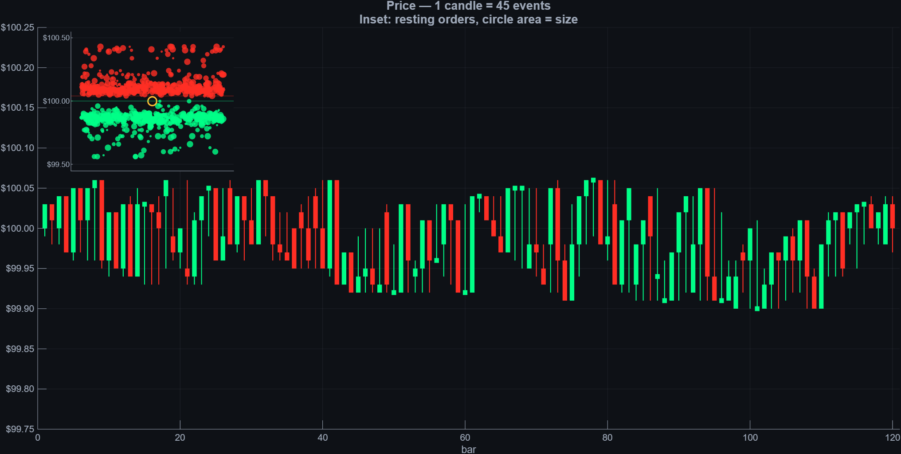

# order-book-auction-sim

Interactive MATLAB simulation of a limit order book and the auction that sets price.



## What it shows

Price isn't handed down — it's discovered, moment to moment, by a two-sided auction. This simulation makes that visible: resting bids and offers stack up on either side of the book, incoming orders lift offers or hit bids, and the last trade prints where buyers and sellers actually meet. Watch it run and the abstractions behind a price chart — depth, spread, the hand-off of control between buyers and sellers — become concrete.

It's a teaching tool, not a trading model: the aim is intuition about market microstructure, not forecasting.

## Requirements

- MATLAB (base) — no additional toolboxes required.
- Developed and tested on R2025b. Earlier releases will likely work but are untested.

## Usage

Clone or download the repository, add the folder to your MATLAB path, and from the Command Window type:

​```matlab
OrderBookSim
​```

The simulation launches directly — no arguments or setup needed.

## License

Released under the MIT License. See [LICENSE](LICENSE).

## Author

Siva Chittajallu

If you use or adapt this in your own work, a citation to this repository is appreciated.
